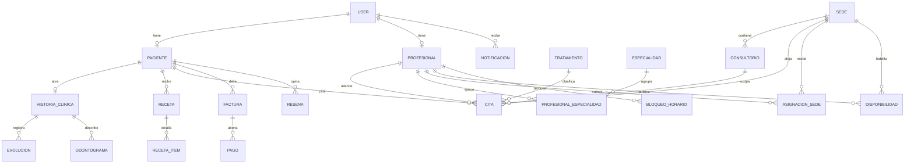

# Esquema de datos

MySQL es la base de la clínica (`USE_SQLITE=False`). Las pruebas usan SQLite. Las tablas nuevas conviven con `Paciente`, `Profesional`, `ClinicCenter` y `Cita`: las migraciones agregan columnas y filas, no vacían las que ya existen.

## Relación

## Tablas

| Tabla | Para qué sirve |
| --- | --- |
| `auth_user` | Cuenta de acceso (correo y contraseña). El paciente ya no guarda clave propia. |
| `accounts_paciente` | Identidad, contacto, EPS y antecedentes del registro. |
| `accounts_profesional` | Identidad profesional. El texto `especialidad` se conserva y se copia al catálogo. |
| `accounts_cliniccenter` | Solicitud pública de un centro. No es una sede de atención. |
| `clinica_especialidad` | Catálogo de especialidades (ortodoncia, endodoncia, etc.). |
| `clinica_profesionalespecialidad` | Relación profesional–especialidad, con una marcada como principal. |
| `clinica_sede` | Sede: dirección, ciudad, horario y punto en el mapa. |
| `clinica_consultorio` | Consultorio dentro de una sede. |
| `clinica_asignacionsede` | En qué sede atiende cada profesional. |
| `clinica_tratamiento` | Catálogo de procedimientos: duración y precio de referencia. |
| `clinica_disponibilidad` | Franja semanal en la que se pueden ofrecer citas. |
| `clinica_bloqueohorario` | Bloqueo (almuerzo, permiso, mantenimiento). |
| `citas_cita` | Cita con sede, consultorio, tratamiento, duración, hora de fin y estado. |
| `historia_historiaclinica` | Historia del paciente. La migración copia antecedentes que ya estaban en el registro. |
| `historia_evolucion` | Nota clínica de una atención. |
| `historia_odontograma` | Estado de un diente permanente (notación FDI). |
| `historia_receta` | Fórmula del especialista. |
| `historia_recetaitem` | Medicamento, dosis, frecuencia y duración. |
| `facturacion_factura` | Cobro al paciente. |
| `facturacion_pago` | Abono (efectivo, transferencia, tarjeta o PSE). |
| `comunicacion_notificacion` | Aviso de cita para el usuario. No guarda la historia clínica. |
| `comunicacion_resena` | Calificación y comentario publicados en la página de inicio. |

## Migraciones de datos

Son reversibles (`RunPython` con marcha atrás). No hacen `DROP` de columnas que ya tenían pacientes o citas.

| Migración | Qué hace | Marcha atrás |
| --- | --- | --- |
| `clinica.0002_vincular_especialidades` | Crea el catálogo de especialidades y enlaza cada profesional según el texto que ya tenía. | Quita ese enlace principal y borra la especialidad del catálogo solo si nadie más la usa. El texto en `Profesional.especialidad` sigue ahí. |
| `citas.0003_rellenar_fecha_fin` | Calcula `fecha_fin` con la hora y la duración (30 minutos si no había otra). No cambia `fecha_hora`. | Deja `fecha_fin` en blanco. La hora de la cita no se toca. |
| `historia.0002_copiar_antecedentes` | Abre una historia y copia `dental_history` y `medications`. Esos campos del paciente permanecen. | Devuelve el texto al paciente si allí estaba vacío y borra la historia solo si no la editaron y no tiene evolución ni odontograma. |

`citas.0002` agrega sede, consultorio, tratamiento y duración con valores nulos o 30 minutos. Las citas viejas siguen siendo válidas.
